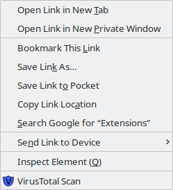

# vtscan
Add-on: Scan URL with VirusTotal

This add-on allows to scan a given URL with multiple virus scanners. VirusTotal provides this service. See https://www.virustotal.com/. Right click on the URL. Select VirusTotal Scan. Observe the scan results. By default the scan results are displayed in a new window. A new tab display configuration option is available.

